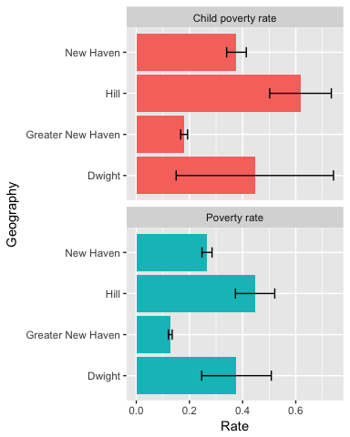

Example ACS profile - New Haven
================

This vignette is intended to show a simple workflow with the `acsprofiles` package. This example will walk through calculations from a few ACS tables with a short list of New Haven neighborhoods, some by block group and some by tract only, plus New Haven and the Greater New Haven region.

Note that `acsprofiles` imports the `acs` package, so its functions are already available. It imports some `dplyr` and `purrr` functions as well, but it's best to load those entirely.

``` r
library(acsprofiles)
library(dplyr)
library(purrr)
```

Setup
-----

First, get some variables to work with throughout the script. To keep it short, I'll pick just two neighborhoods: Dwight and the Hill, which give us a mix of neighborhoods made up of only one tract, and neighborhoods that require aggregation of several tracts. `nhv_neighborhoods` has neighborhoods by both tract & block group, while `nhv_tracts` has neighborhoods defined more simply by just tracts. This is necessary because some ACS tables aren't available at the block group level but are still useful to us.

This mini-profile will include:

-   Total populations
-   Population for whom poverty status is determined
-   Number of residents below 1.00 x poverty level
-   Percentage of residents below 1.00 x poverty level, out of number for whom status is determined
-   Number of residents below 2.00 x poverty level
-   Percentage of residents below 2.00 x poverty level, out of number for whom status is determined
-   Number of residents ages 0-17 for whom poverty status is determined
-   Number of residents ages 0-17 below 1.00 x poverty level
-   Percentage of residents ages 0-17 below 1.00 x poverty level, out of number for whom status is determined
-   Number of residents ages 0-17 below 2.00 x poverty level
-   Percentage of residents ages 0-17 below 2.00 x poverty level, out of number for whom status is determined
-   Margins of error for each at 90% confidence level

``` r
data("nhv_neighborhoods")
data("nhv_tracts")
data("regions")

# get neighborhoods that include block groups for Dwight & Hill
bg <- nhv_neighborhoods[c("dwight", "hill")]

# get neighborhoods defined only by tract for Dwight & Hill
tracts <- nhv_tracts[c("dwight", "hill")]

# copy Greater New Haven region from regions
gnh <- regions$`Greater New Haven`

# run get_town_names to save lookup list of all CT towns
ct_towns <- get_town_names(state = 9)

# save table numbers needed for convenience
# B01003: total population, available by block group
# C17002: ratio of income to poverty, available by block group
# B17024: ratio of income to poverty by sex & age, available only by tract
pop_table_num <- "B01003"
pov_table_num <- "C17002"
pov_age_table_num <- "B17024"
```

My preferred method to pull all these tables is to vectorize as much of the process as possible. In doing full profiles, I keep all the table numbers saved in a named list, and then iterate over it with the `map` functions from the `purrr` package, part of the [Tidyverse](http://tidyverse.org/). For clarity and to focus on the `acsprofiles` functions, I'll do these separately.

`acsprofiles` includes functions to make ACS geographies for groups of tracts, tracts plus block groups, and towns, which are called by the functions `neighborhood_table` and `regional_table`, so we don't need to build the geographies manually. For the New Haven geography, it's just the usual `geo.make` function from `acs`.

``` r
nhv_geo <- geo.make(state = 9, county = 9, county.subdivision = "New Haven")
```

`acs` includes a great `rbind` function, so we can stick all these tables together and work with them normally.

Fetch tables with custom geos
-----------------------------

First I'll get the total population tables. I'm also shortening the name listed for New Haven because it's annoyingly long.

``` r
# keeping defaults of state = 9, county = 9 for New Haven County, CT
nhood_pop <- neighborhood_table(neighborhood_list = bg, table.number = pop_table_num, year = 2015, blocks = T)

city_pop <- acs.fetch(geography = nhv_geo, endyear = 2015, table.number = pop_table_num, col.names = "pretty")
geography(city_pop)$NAME <- "New Haven"

gnh_pop <- regional_table(gnh, name = "Greater New Haven", town_lookup = ct_towns, table.number = pop_table_num, year = 2015)

all_pops <- list(nhood_pop, city_pop, gnh_pop) %>% reduce(rbind.acs)
acs.colnames(all_pops) <- "num_total_pop"

# clean up
rm(nhood_pop, city_pop, gnh_pop)
```

Next, poverty rates.

``` r
nhood_pov <- neighborhood_table(neighborhood_list = bg, table.number = pov_table_num, year = 2015, blocks = T)

city_pov <- acs.fetch(geography = nhv_geo, endyear = 2015, table.number = pov_table_num, col.names = "pretty")
geography(city_pov)$NAME <- "New Haven"

gnh_pov <- regional_table(gnh, name = "Greater New Haven", town_lookup = ct_towns, table.number = pov_table_num, year = 2015)

all_povs <- list(nhood_pov, city_pov, gnh_pov) %>% reduce(rbind.acs)
rm(nhood_pov, city_pov, gnh_pov)
```

Last, poverty rates by age. Note that this table is only available by tract, not block group.

``` r
nhood_pov2 <- neighborhood_table(neighborhood_list = tracts, table.number = pov_age_table_num, year = 2015, blocks = F)

city_pov2 <- acs.fetch(geography = nhv_geo, endyear = 2015, table.number = pov_age_table_num, col.names = "pretty")
geography(city_pov2)$NAME <- "New Haven"

gnh_pov2 <- regional_table(gnh, name = "Greater New Haven", town_lookup = ct_towns, table.number = pov_age_table_num, year = 2015)

all_pov_age <- list(nhood_pov2, city_pov2, gnh_pov2) %>% reduce(rbind.acs)
rm(nhood_pov2, city_pov2, gnh_pov2)
```

Calculations
------------

`acsprofiles` includes functions to make it easier to do calculations. For this mini-profile, I need to calculate total numbers and percentages of people under 1x the poverty line and 2x the poverty line. I also need to calculate the number of people with a poverty status ages 0-17, and then the total numbers and percentages of them under 1x the poverty line and 2x the poverty line.

The function `calc_acs_table` calculates an aggregated sum and percentage over a given denominator. The function takes a named list of the column numbers that need to be added. Because the tables for each geography are bound together into a single ACS object, I can do each calculation once across all these geographies.

First, calculate poverty and low-income rates. I'll use `cbind.acs` from the `acs` package to bind the first column, number of people with poverty status determined, to the table that I calculate.

``` r
# all_povs@acs.colnames
# need to add columns 2 and 3 to get population below poverty, and columns 2 to 7 to get low-income
# Column 1 will be the denominator, as this has the total population with a poverty status
pov_groups <- list(
  poverty = 2:3,
  low_inc = 2:7
)
pov_calculated <- calc_acs_table(groups = pov_groups, denom = all_povs[, 1], table = all_povs)
pov_rates <- cbind.acs(all_povs[, 1], pov_calculated)

# manually set nicer column names
acs.colnames(pov_rates) <- c("num_pov_status", "num_poverty", "per_poverty", "num_low_inc", "per_low_inc")
rm(pov_groups, pov_calculated)
pov_rates
```

    ## ACS DATA: 
    ##  2011 -- 2015 ;
    ##   Estimates w/90% confidence intervals;
    ##   for different intervals, see confint()
    ##                   num_pov_status              num_poverty               
    ## dwight            3875 +/- 776.707152020631   1461 +/- 414.039853154259 
    ## hill              16246 +/- 1278.20655607769  7263 +/- 1059.85046115006 
    ## New Haven         121961 +/- 552              32480 +/- 2311.81249239639
    ## Greater New Haven 446402 +/- 861.266509275729 57059 +/- 2945.35430805871
    ##                   per_poverty                             
    ## dwight            0.377032258064516 +/- 0.130873674568179 
    ## hill              0.447063892650499 +/- 0.0741159353182393
    ## New Haven         0.266314641565746 +/- 0.01899362701244  
    ## Greater New Haven 0.127819767832581 +/- 0.0066025934437306
    ##                   num_low_inc                
    ## dwight            2760 +/- 742.808185199921  
    ## hill              11849 +/- 1350.31292669514 
    ## New Haven         59530 +/- 3005.96523599326 
    ## Greater New Haven 119776 +/- 4164.46995426789
    ##                   per_low_inc                              
    ## dwight            0.712258064516129 +/- 0.239014538481742  
    ## hill              0.729348762772375 +/- 0.101001408112877  
    ## New Haven         0.488106853830323 +/- 0.0247457488107175 
    ## Greater New Haven 0.268314210061783 +/- 0.00934331996574811

Then, calculate poverty & low-income rates for children, again using `cbind.acs` to bind the number with poverty status determined to the calculated table.

``` r
# all_pov_age@acs.colnames
# This table has 131 columns! They're broken into small age groups. The relevant ones:
# * cols 2, 15, and 28 add up to the poverty status for ages 0-17--no percentage is needed, so I'll just use apply to add them
# * cols 3-5, 16-18, and 29-31 add up to ages 0-17 below 1.00x poverty line
# * cols 3-10, 16-23, and 29-36 add up to ages 0-17 below 2.00x poverty line
pov_determined <- apply(X = all_pov_age[, c(2, 15, 28)], FUN = sum, MARGIN = 2, agg.term = "num_pov_status")
pov_age_groups <- list(
  poverty = c(3:5, 16:18, 29:31),
  low_inc = c(3:10, 16:23, 29:36)
)
child_pov_calculated <- calc_acs_table(groups = pov_age_groups, denom = pov_determined, table = all_pov_age)
child_pov_rates <- cbind.acs(pov_determined, child_pov_calculated)
acs.colnames(child_pov_rates) <- c("num_child_pov_status", "num_child_poverty", "per_child_poverty", "num_child_low_inc", "per_child_low_inc")
# clean up
rm(pov_determined, pov_age_groups, child_pov_calculated)
child_pov_rates
```

    ## ACS DATA: 
    ##  2011 -- 2015 ;
    ##   Estimates w/90% confidence intervals;
    ##   for different intervals, see confint()
    ##                   num_child_pov_status       num_child_poverty         
    ## dwight            794 +/- 276.956675312223   354 +/- 199.612123880289  
    ## hill              4938 +/- 526.835837809084  3053 +/- 473.338145515444 
    ## New Haven         28547 +/- 1202.6279557702  10755 +/- 942.723183124293
    ## Greater New Haven 94925 +/- 2087.00790607032 17047 +/- 1225.14529750557
    ##                   per_child_poverty                       
    ## dwight            0.445843828715365 +/- 0.295613613555214 
    ## hill              0.618266504657756 +/- 0.116359478495905 
    ## New Haven         0.376747118786563 +/- 0.0366396284191162
    ## Greater New Haven 0.179583882012115 +/- 0.0134968781281885
    ##                   num_child_low_inc         
    ## dwight            700 +/- 285.643133997651  
    ## hill              4519 +/- 563.046179278396 
    ## New Haven         18086 +/- 1196.0656336506 
    ## Greater New Haven 32929 +/- 1659.98795176351
    ##                   per_child_low_inc                      
    ## dwight            0.881612090680101 +/- 0.473273849460983
    ## hill              0.915147833130822 +/- 0.150114298101587
    ## New Haven         0.633551686692122 +/- 0.049677184544275
    ## Greater New Haven 0.346894917039768 +/- 0.019078147183762

Bind tables together into data frame
------------------------------------

I'll use the `cbind.acs` function from `acs` to bind all these tables together into one acs object, then extract the geography names, estimates, and margins of error to make a data frame.

One trick is that I've used `acs.colnames` to give all my variables names starting either with "num" or "per", based on whether they hold an integer, like a population, or a percentage. That simplifies rounding: the margins of error for population counts don't need all the decimal places that they currently have, so I want to round those off to whole numbers. I also only want to report 3 decimal places for the percentages and their margins of error. Because I've named columns in this way, I can use the `mutate_at` function from `dplyr` to change columns based on the letters their names start with.

I'll also use the `arrange_est_moe` function from `acsprofiles`. When I make the data frame, all the estimates will get dumped in together, and all the margins of error will get dumped in together, but I want this rearranged so each variable is followed by the corresponding margin of error. I also want the names of margins of error columns to match their variables, but with "moe" stuck to the end without any extra typing. `arrange_est_moe` takes care of all of this. I'll have the function omit the first column from the shuffling, as this holds the names of geographies.

``` r
all_tables <- list(all_pops, pov_rates, child_pov_rates) %>% reduce(cbind.acs)

profile_df <- data.frame(name = all_tables@geography$NAME, all_tables@estimate, all_tables@standard.error * qnorm(0.95), row.names = NULL) %>% 
  tbl_df() %>%
  mutate_at(vars(starts_with("per")), funs(round(., digits = 3))) %>%
  mutate_at(vars(starts_with("num")), funs(round(., digits = 0))) %>%
  arrange_est_moe(omit = 1) %>%
  mutate(name = stringr::str_to_title(name))
profile_df
```

    ## # A tibble: 4 x 23
    ##                name num_total_pop num_total_pop_moe num_pov_status
    ##               <chr>         <dbl>             <dbl>          <dbl>
    ## 1            Dwight          3915               777           3875
    ## 2              Hill         16792              1288          16246
    ## 3         New Haven        130612                50         121961
    ## 4 Greater New Haven        465068               147         446402
    ## # ... with 19 more variables: num_pov_status_moe <dbl>, num_poverty <dbl>,
    ## #   num_poverty_moe <dbl>, per_poverty <dbl>, per_poverty_moe <dbl>,
    ## #   num_low_inc <dbl>, num_low_inc_moe <dbl>, per_low_inc <dbl>,
    ## #   per_low_inc_moe <dbl>, num_child_pov_status <dbl>,
    ## #   num_child_pov_status_moe <dbl>, num_child_poverty <dbl>,
    ## #   num_child_poverty_moe <dbl>, per_child_poverty <dbl>,
    ## #   per_child_poverty_moe <dbl>, num_child_low_inc <dbl>,
    ## #   num_child_low_inc_moe <dbl>, per_child_low_inc <dbl>,
    ## #   per_child_low_inc_moe <dbl>

Now all that's missing is to give the data frame some nice, display-worthy names.

``` r
names(profile_df) <- c("Geography", "Total population", "MOE total population", "Population, poverty status determined", "MOE population poverty status determined", "Population in poverty", "MOE population in poverty", "Poverty rate", "MOE poverty rate", "Population low-income", "MOE population low-income", "Low-income rate", "MOE low-income rate", "Population ages 0-17, poverty status determined", "MOE population ages 0-17, poverty status determined", "Population ages 0-17 in poverty", "MOE population ages 0-17 in poverty", "Child poverty rate", "MOE child poverty rate", "Population ages 0-17 low-income", "MOE population ages 0-17 low income", "Child low-income rate", "MOE child low-income rate")
```

Finishing up
------------

Often, at this point I'll write this to a csv file for use in visualizations or distribution. Note that for these small areas such as block groups, margins of error can be very high. I'll graph poverty rates with error bars to illustrate this.

``` r
library(ggplot2)
library(tidyr)

# select rate columns and their margins of error
# make long format for ggplot
pov_df <- profile_df %>% 
  select(1, 8, 9, 18, 19) %>%
  mutate(`Poverty rate_upper` = `Poverty rate` + `MOE poverty rate`,
         `Poverty rate_lower` = `Poverty rate` - `MOE poverty rate`,
         `Child poverty rate_upper` = `Child poverty rate` + `MOE child poverty rate`,
         `Child poverty rate_lower` = `Child poverty rate` - `MOE child poverty rate`) %>%
  select(-`MOE poverty rate`, -`MOE child poverty rate`)
# splitting into rates and bounds in order to gather, then will stick back together
# use gather to make long format
rates <- pov_df %>% 
  select(Geography, `Poverty rate`, `Child poverty rate`) %>%
  gather(key = Measure, value = Rate, -Geography)
# use gather to make long format, separate to get type of measure & type of bound, then spread to make individual columns for upper & lower bounds
bounds <- pov_df %>% 
  select(Geography, 4:7) %>%
  gather(key = Measure, value = Bound, -Geography) %>%
  separate(Measure, into = c("Measure", "Bound_type"), sep = "_") %>%
  spread(key = Bound_type, value = Bound)

# join rates & bounds
pov_long <- inner_join(rates, bounds, by = c("Geography", "Measure"))
pov_long
```

    ## # A tibble: 8 x 5
    ##           Geography            Measure  Rate lower upper
    ##               <chr>              <chr> <dbl> <dbl> <dbl>
    ## 1            Dwight       Poverty rate 0.377 0.246 0.508
    ## 2              Hill       Poverty rate 0.447 0.373 0.521
    ## 3         New Haven       Poverty rate 0.266 0.247 0.285
    ## 4 Greater New Haven       Poverty rate 0.128 0.121 0.135
    ## 5            Dwight Child poverty rate 0.446 0.150 0.742
    ## 6              Hill Child poverty rate 0.618 0.502 0.734
    ## 7         New Haven Child poverty rate 0.377 0.340 0.414
    ## 8 Greater New Haven Child poverty rate 0.180 0.167 0.193

``` r
rm(rates, bounds)

ggplot(pov_long, aes(x = Geography, y = Rate, fill = Measure)) +
  geom_bar(stat = "identity") +
  geom_errorbar(aes(ymin = lower, ymax = upper), width = 0.25) +
  facet_wrap(~ Measure, ncol = 1) +
  guides(fill = F) +
  coord_flip()
```


